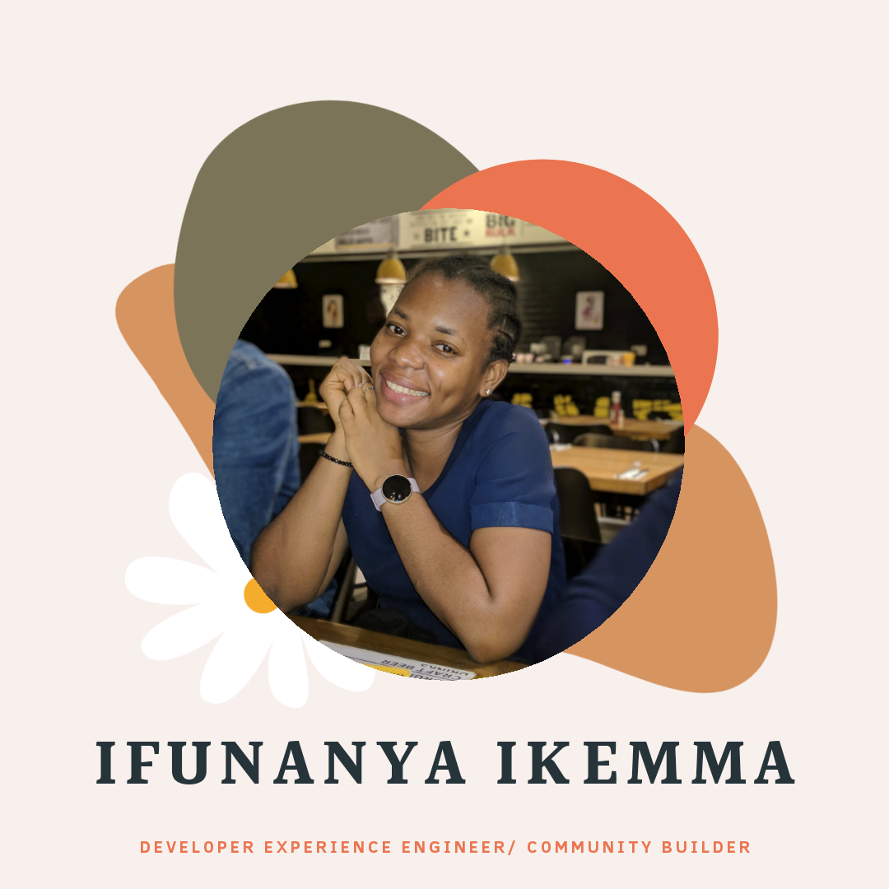

### Hi, I'm Iphie 👋 ✨👩🏾•💻

**A passionate Developer Experience Engineer (Software Engineer/Customer Engineer/Community Builder/Event Facilitator/Open source Contributor)** 

I enjoy building web applications with Nodejs, Typescript and Ruby on Rails.

I lead a  non-profit organization Hyperspace which is centred on empowering student developers in Africa to **build actual stuffs** through hackathons and learnables.

 I also organize community events and workshops and mentor women from underepresented communities and also an active contributor in open source projects.

🔭 I’m currently working on scaling Hyperspace to all the African countries with my team.

# 📫 How to reach me:
Twitter - <a href="https://twitter.com/iphytech">iphytech</a>

💼 Linkedin - <a href="https://www.linkedin.com/in/ifunanya-ikemma-75698490/"> Ifunanya Ikemma</a>

😄 Pronouns: ... She/her

